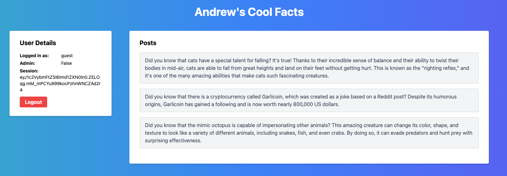
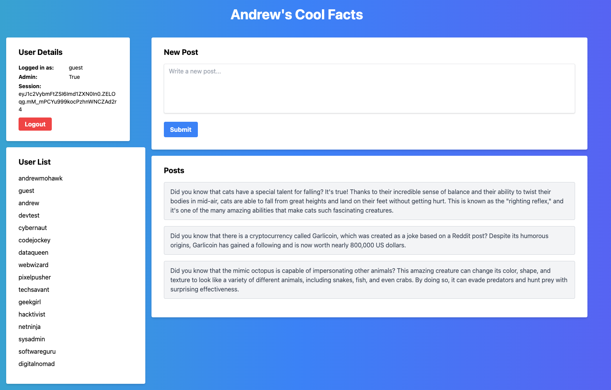
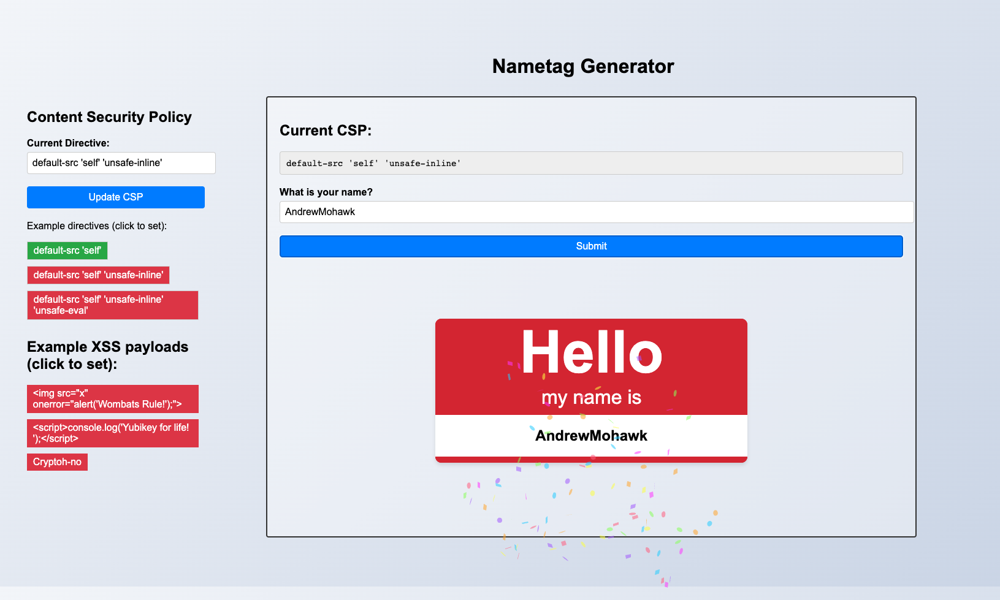

# SecurityAwareness
Few simple/fun apps built for security awareness. Most just need flask, you can install with: 

```pip3 install flask```

To run the applications:

```python3 app.py```

And then browse to http://127.0.0.1:5000

## Andrews Cool Facts
Cool fact webapp where you can influence the cookies to show admin functionality and see the session IDs exposed. 

Does not correctly destroy sessions, validates admin from cookies.



## Name Tag Generator
App allows you to modify the CSP. Users can input a name to be displayed in a "Hello My name is" name tag. Has options for different CSPs as well as example XSS payloads.

Does not sanitize user input.



# webcam
Tiny python script to show screengrab from the webcam to show TCC permissions on Mac